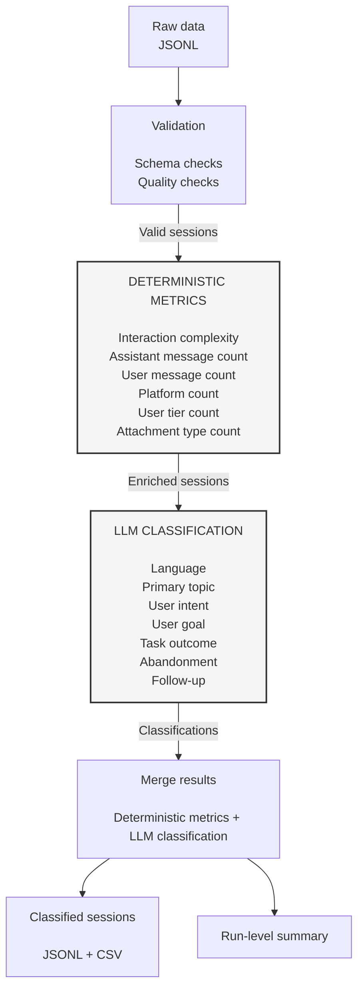

This chat session analytics tool analyses both deterministic and AI-powered metrics.

- Free tier LLM: the configuration for the Gemini wrapper has been optimised for the free tier in order to stay within the rate limit.
- Optimization: multiple calls are parallelized and sessions are processed in batches for quicker run time.
- Deterministic metrics: we extract attachment types, tier level, and other relevant user information.
- LLM metrics: we get insights into what users are talking about (topic, intent, goal...) as well as important information about the interaction with the assistant (outcome, follow up needed, language...).
- The processing time for this script is around 6-7 seconds for 150 sessions if no retries are needed for the LLM call.

Please see mermaid chart below for a schema of the tool.

Next steps should focus on turning this prototype into a secure and scalable system.
In practice, this means:
- implementing an observability system, such as Phoenix (Arize AI), to track LLM costs and evaluation.
- further improving data validation and error reporting
- testing with a paid tier LLM and adjusting configuration
- testing with larger amounts of data to ensure the system can handle larger workloads
- checking future sessions that are labelled "other" in and reassessing the topic taxonomies
- implementing unit tests 

